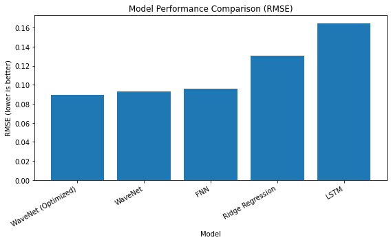
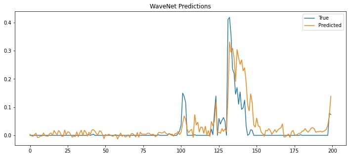
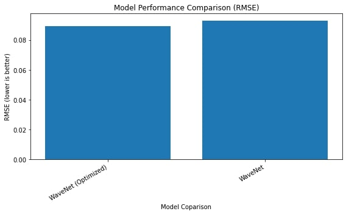

# Assignment 2 – Climate Forecasting

**Student Project @ TU Wien**  
**191.021 Introduction to Computational Sustainability, 2025 Winter Semester**

**Students:**  
Patrick Ennemoser · Dragana Sunaric · Daniel Martin Pühringer  

---

## Project Introduction

Climate change is increasing the frequency and severity of extreme weather events, making accurate and efficient climate forecasting essential for climate adaptation, risk mitigation, and infrastructure planning. Precipitation forecasting is particularly relevant due to its strong impact on hydrology, agriculture, flood management, and water resources.  

In this project, we investigate the effectiveness of different machine learning models for **next-day precipitation forecasting in Central Europe**. Using the **LamaH (Large-Sample Data for Hydrology and Environmental Sciences)** dataset, which provides over 35 years of meteorological time series and rich environmental attributes across 859 catchments, we compare classical statistical methods with neural network–based approaches. The goal is to analyze trade-offs between predictive accuracy, model complexity, and computational efficiency in the context of sustainable climate modeling.

---

## Evaluation

The evaluation is organized across multiple Jupyter notebooks, each focusing on a specific model or preprocessing step:

- **`preprocessing.ipynb`**  
  - Data loading and cleaning  
  - Selection of 100 random catchments  
  - Feature aggregation (daily statistics)
  - Naive Baseline forecast (MA & t-1)
  - Train/validation/test splitting  

- **`RidgeRegression.ipynb`**  
  - Baseline linear model with L2 regularization  

- **`Feed_Forward_NN.ipynb`**  
  - Multilayer Perceptron (FNN)  

- **`LSTM.ipynb`**  
  - Recurrent Neural Network with Long Short-Term Memory  

- **`WaveNet.ipynb`**  *- best performance of all models*
  - Convolutional neural network with causal and dilated convolutions  
  - Includes model finetuning and architectural optimization  

- **`plot_model_performance.ipynb`**  
  - Centralized comparison of all models  
  - Visualization of error metrics (e.g., RMSE)  
  - Aggregated performance plots used for final evaluation  

---

## Results
The transition from a naive MSE (from a
t-1 Forecast) of 8.06 to a learned model RMSE of 0.0893
represents a fundamental leap (90-fold) in predictive accuracy,
validating the use of the LamaH dataset for training complex
forecasting systems.

### Model Performance Comparison

Among the evaluated models, WaveNet emerged as the
superior architecture, achieving an RMSE of 0.0930 in its base
form and further improving to 0.0893 after hyperparameter
optimization. This tuning of hyperparameters resulted in an
improvement by approx. 4%. While the FNN performed
surprisingly well, the LSTM struggled to capture long-term
dependencies as effectively as the convolutional approach
(WaveNet). Ultimately, this project confirms that convolutional
sequence models like WaveNet are highly effective for climate
forecasting.



*The plot compares the Root Mean Square Error (RMSE) of Ridge Regression, Feedforward Neural Network, LSTM, WaveNet and the fine-tuned WaveNet models. WaveNet achieves the lowest error, demonstrating superior performance on next-day precipitation prediction.*

### Performance of WaveNet


### Before and after parameter tuning of WaveNet
Since WaveNet can be seen as the best performing model,
we optimized the hyperparameters of WaveNet to study the
best achievable results. As stated in the lecture, we included
architectural changes as well in this optimization process. The
resulting boost in performance can be seen below, where
the optimized version achieves significantly better results than
the original WaveNet implementation. We implemented three
main changes to achieve this:
1. **Improved layer architecture**: The first improvement
was done by changing one important layer of our NN.
Instead of using layers.Flatten(), which seemed very 
logical in the initial implementation, the optimized ver-
sion uses layers.GlobalAveragePooling1D()(x) instead of
layers.Flatten(). Flatten() turns [time, channels] into a
larger vector which can result in making the model more
sensitive to sequence length. This sequence length is
important and therefore this change was a significant
improvement for this time-series regression. GlobalAv-
eragePooling is more flexible and reduces parameter
count.
2. **Improved loss function**: The second improvement was
done by changing the loss function. Initially, we used
the ”Mean Squared Error” loss function, which is simple
and commonly used. We switched to ”Huber loss” since
this loss is known to be more stable with large outliers
3. **Increased number of epochs with early stopping**: Our
last improvement was to increase the amount of epochs.
This seemed to be the most straight-forward approach
for any hyperparameter tuning, however we wanted to
be conscious of sustainability and the increased compu-
tational costs high amount of epochs entail. As a rule
of thumb, an increase of epochs is expected to result in
better performing models, however due to diminishing
returns many epochs are not providing any significant
improvement at a certain level and are a waste of energy.
So finding a suitable amount of epochs was important
to us. This is what our last optimization does: We
added a callback so that the model runs 200 epochs by
default, however as soon as no significant improvement
is expected (because a plateau was reached), the model
training terminates early and keeps the best result. In
our case, this was 45 epochs.

**The figure below shows the results of these three optimizations. The
RMSE reduced from 0.093 (before hyperparameter tuning)
to 0.0893 after hyperparameter tuning. This means that the
accuracy of the model after the hyperparameter tuning was
improved by approx. 3.9785%.**

**The plot above compares Performance of WaveNet before and after hyperparameter tuning**
---

## Repository Structure (Overview)

```text
.
├── data/
│   ├── preprocessing.ipynb
│   ├── RidgeRegression.ipynb
│   ├── Feed_Forward_NN.ipynb
│   ├── LSTM.ipynb
│   └── WaveNet.ipynb
├── plot_model_performance.ipynb
└── README.md
